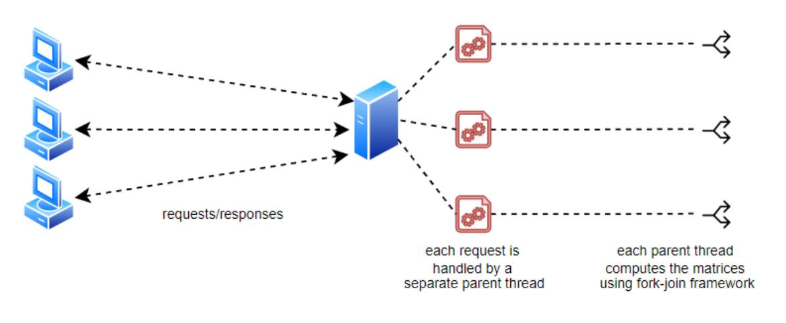
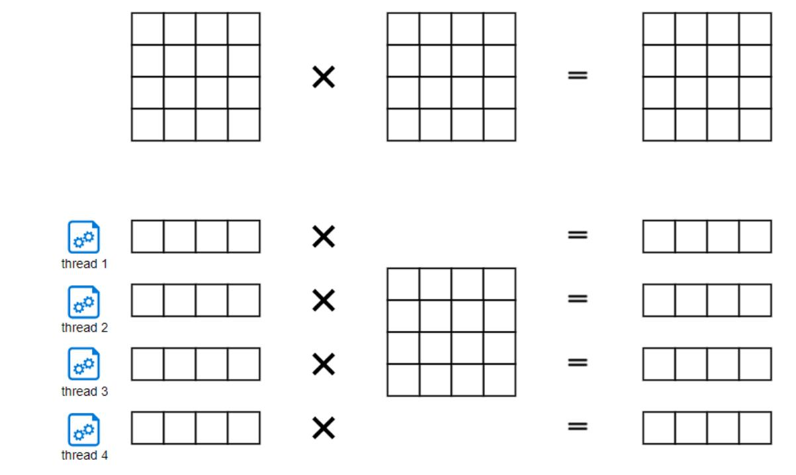

# clientServer-matrixMultiplication
A pair of client and server programs to perform matrix  multiplication:

- The client is responsible to generate two random matrices and send them to the server. 
- The server is responsible to compute the product of the two matrices and send it back to the client.
- The server should be able to handle multiple client requests concurrently (Figure 1). 
- The server should use fork-join framework – a multithreaded computation model to speed up the matrix multiplication (Figure 2). 
- The client then checks the correctness of the product matrix computed by the server.

Figure 1. A reference model on how to handle multiple client requests.

Figure 2. Transforming a single-thread multiplication task to a multi-thread multiplication task. A NxM matrix can be divided into N rows.  Each row is then computed by a different thread independently
